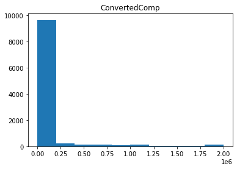
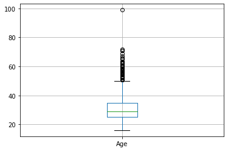
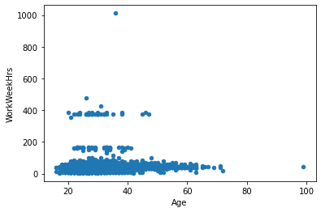
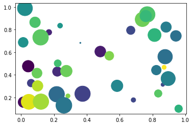
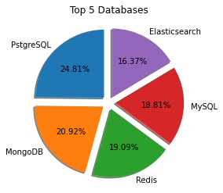
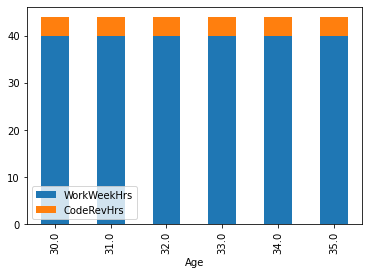
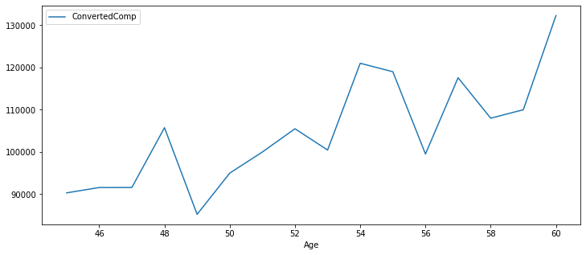
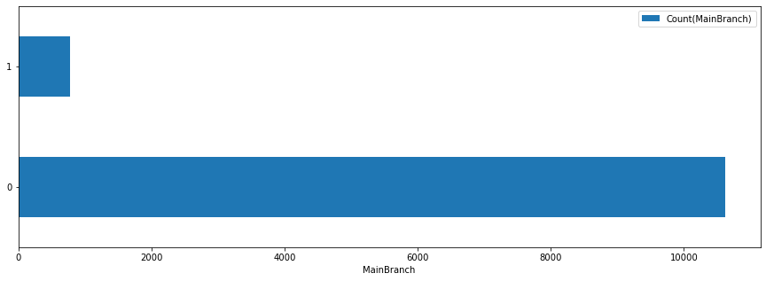

# **Data Visualization with SQL**


## Objectives


-   Visualize the distribution of data.

-   Visualize the relationship between two features.

-   Visualize composition of data.

-   Visualize comparison of data.


<hr>


## Working with database


Download database file.


```python
!wget https://cf-courses-data.s3.us.cloud-object-storage.appdomain.cloud/IBM-DA0321EN-SkillsNetwork/LargeData/m4_survey_data.sqlite
```

    --2021-02-15 18:10:03--  https://cf-courses-data.s3.us.cloud-object-storage.appdomain.cloud/IBM-DA0321EN-SkillsNetwork/LargeData/m4_survey_data.sqlite
    Resolving cf-courses-data.s3.us.cloud-object-storage.appdomain.cloud (cf-courses-data.s3.us.cloud-object-storage.appdomain.cloud)... 198.23.119.245
    Connecting to cf-courses-data.s3.us.cloud-object-storage.appdomain.cloud (cf-courses-data.s3.us.cloud-object-storage.appdomain.cloud)|198.23.119.245|:443... connected.
    HTTP request sent, awaiting response... 200 OK
    Length: 36679680 (35M) [application/octet-stream]
    Saving to: ‘m4_survey_data.sqlite.4’
    
    m4_survey_data.sqli 100%[===================>]  34.98M  43.7MB/s    in 0.8s    
    
    2021-02-15 18:10:04 (43.7 MB/s) - ‘m4_survey_data.sqlite.4’ saved [36679680/36679680]
    
    

Connect to the database.


```python
import sqlite3
conn = sqlite3.connect("m4_survey_data.sqlite") # open a database connection
```

Import pandas module.


```python
import pandas as pd

```

## Demo: How to run an sql query


```python
# print how many rows are there in the table named 'master'
QUERY = """
SELECT COUNT(*)
FROM master
"""

# the read_sql_query runs the sql query and returns the data as a dataframe
df = pd.read_sql_query(QUERY,conn)
df.head()
```


<div>
<style scoped>
    .dataframe tbody tr th:only-of-type {
        vertical-align: middle;
    }

    .dataframe tbody tr th {
        vertical-align: top;
    }

    .dataframe thead th {
        text-align: right;
    }
</style>
<table border="1" class="dataframe">
  <thead>
    <tr style="text-align: right;">
      <th></th>
      <th>COUNT(*)</th>
    </tr>
  </thead>
  <tbody>
    <tr>
      <th>0</th>
      <td>11398</td>
    </tr>
  </tbody>
</table>
</div>


## Demo: How to list all tables


```python
# print all the tables names in the database
QUERY = """
SELECT name as Table_Name FROM
sqlite_master WHERE
type = 'table'
"""
# the read_sql_query runs the sql query and returns the data as a dataframe
pd.read_sql_query(QUERY,conn)

```


<div>
<style scoped>
    .dataframe tbody tr th:only-of-type {
        vertical-align: middle;
    }

    .dataframe tbody tr th {
        vertical-align: top;
    }

    .dataframe thead th {
        text-align: right;
    }
</style>
<table border="1" class="dataframe">
  <thead>
    <tr style="text-align: right;">
      <th></th>
      <th>Table_Name</th>
    </tr>
  </thead>
  <tbody>
    <tr>
      <th>0</th>
      <td>EduOther</td>
    </tr>
    <tr>
      <th>1</th>
      <td>DevType</td>
    </tr>
    <tr>
      <th>2</th>
      <td>LastInt</td>
    </tr>
    <tr>
      <th>3</th>
      <td>JobFactors</td>
    </tr>
    <tr>
      <th>4</th>
      <td>WorkPlan</td>
    </tr>
    <tr>
      <th>5</th>
      <td>WorkChallenge</td>
    </tr>
    <tr>
      <th>6</th>
      <td>LanguageWorkedWith</td>
    </tr>
    <tr>
      <th>7</th>
      <td>LanguageDesireNextYear</td>
    </tr>
    <tr>
      <th>8</th>
      <td>DatabaseWorkedWith</td>
    </tr>
    <tr>
      <th>9</th>
      <td>DatabaseDesireNextYear</td>
    </tr>
    <tr>
      <th>10</th>
      <td>PlatformWorkedWith</td>
    </tr>
    <tr>
      <th>11</th>
      <td>PlatformDesireNextYear</td>
    </tr>
    <tr>
      <th>12</th>
      <td>WebFrameWorkedWith</td>
    </tr>
    <tr>
      <th>13</th>
      <td>WebFrameDesireNextYear</td>
    </tr>
    <tr>
      <th>14</th>
      <td>MiscTechWorkedWith</td>
    </tr>
    <tr>
      <th>15</th>
      <td>MiscTechDesireNextYear</td>
    </tr>
    <tr>
      <th>16</th>
      <td>DevEnviron</td>
    </tr>
    <tr>
      <th>17</th>
      <td>Containers</td>
    </tr>
    <tr>
      <th>18</th>
      <td>SOVisitTo</td>
    </tr>
    <tr>
      <th>19</th>
      <td>SONewContent</td>
    </tr>
    <tr>
      <th>20</th>
      <td>Gender</td>
    </tr>
    <tr>
      <th>21</th>
      <td>Sexuality</td>
    </tr>
    <tr>
      <th>22</th>
      <td>Ethnicity</td>
    </tr>
    <tr>
      <th>23</th>
      <td>master</td>
    </tr>
  </tbody>
</table>
</div>


## Demo: How to run a group by query


```python
QUERY = """
SELECT Age,COUNT(*) as count
FROM master
group by age
order by age
"""
pd.read_sql_query(QUERY,conn)
```


<div>
<style scoped>
    .dataframe tbody tr th:only-of-type {
        vertical-align: middle;
    }

    .dataframe tbody tr th {
        vertical-align: top;
    }

    .dataframe thead th {
        text-align: right;
    }
</style>
<table border="1" class="dataframe">
  <thead>
    <tr style="text-align: right;">
      <th></th>
      <th>Age</th>
      <th>count</th>
    </tr>
  </thead>
  <tbody>
    <tr>
      <th>0</th>
      <td>NaN</td>
      <td>287</td>
    </tr>
    <tr>
      <th>1</th>
      <td>16.0</td>
      <td>3</td>
    </tr>
    <tr>
      <th>2</th>
      <td>17.0</td>
      <td>6</td>
    </tr>
    <tr>
      <th>3</th>
      <td>18.0</td>
      <td>29</td>
    </tr>
    <tr>
      <th>4</th>
      <td>19.0</td>
      <td>78</td>
    </tr>
    <tr>
      <th>5</th>
      <td>20.0</td>
      <td>109</td>
    </tr>
    <tr>
      <th>6</th>
      <td>21.0</td>
      <td>203</td>
    </tr>
    <tr>
      <th>7</th>
      <td>22.0</td>
      <td>406</td>
    </tr>
    <tr>
      <th>8</th>
      <td>23.0</td>
      <td>581</td>
    </tr>
    <tr>
      <th>9</th>
      <td>24.0</td>
      <td>679</td>
    </tr>
    <tr>
      <th>10</th>
      <td>25.0</td>
      <td>738</td>
    </tr>
    <tr>
      <th>11</th>
      <td>26.0</td>
      <td>720</td>
    </tr>
    <tr>
      <th>12</th>
      <td>27.0</td>
      <td>724</td>
    </tr>
    <tr>
      <th>13</th>
      <td>28.0</td>
      <td>787</td>
    </tr>
    <tr>
      <th>14</th>
      <td>29.0</td>
      <td>697</td>
    </tr>
    <tr>
      <th>15</th>
      <td>30.0</td>
      <td>651</td>
    </tr>
    <tr>
      <th>16</th>
      <td>31.0</td>
      <td>531</td>
    </tr>
    <tr>
      <th>17</th>
      <td>32.0</td>
      <td>489</td>
    </tr>
    <tr>
      <th>18</th>
      <td>33.0</td>
      <td>483</td>
    </tr>
    <tr>
      <th>19</th>
      <td>34.0</td>
      <td>395</td>
    </tr>
    <tr>
      <th>20</th>
      <td>35.0</td>
      <td>393</td>
    </tr>
    <tr>
      <th>21</th>
      <td>36.0</td>
      <td>308</td>
    </tr>
    <tr>
      <th>22</th>
      <td>37.0</td>
      <td>280</td>
    </tr>
    <tr>
      <th>23</th>
      <td>38.0</td>
      <td>279</td>
    </tr>
    <tr>
      <th>24</th>
      <td>39.0</td>
      <td>232</td>
    </tr>
    <tr>
      <th>25</th>
      <td>40.0</td>
      <td>187</td>
    </tr>
    <tr>
      <th>26</th>
      <td>41.0</td>
      <td>136</td>
    </tr>
    <tr>
      <th>27</th>
      <td>42.0</td>
      <td>162</td>
    </tr>
    <tr>
      <th>28</th>
      <td>43.0</td>
      <td>100</td>
    </tr>
    <tr>
      <th>29</th>
      <td>44.0</td>
      <td>95</td>
    </tr>
    <tr>
      <th>30</th>
      <td>45.0</td>
      <td>85</td>
    </tr>
    <tr>
      <th>31</th>
      <td>46.0</td>
      <td>66</td>
    </tr>
    <tr>
      <th>32</th>
      <td>47.0</td>
      <td>68</td>
    </tr>
    <tr>
      <th>33</th>
      <td>48.0</td>
      <td>64</td>
    </tr>
    <tr>
      <th>34</th>
      <td>49.0</td>
      <td>66</td>
    </tr>
    <tr>
      <th>35</th>
      <td>50.0</td>
      <td>57</td>
    </tr>
    <tr>
      <th>36</th>
      <td>51.0</td>
      <td>29</td>
    </tr>
    <tr>
      <th>37</th>
      <td>52.0</td>
      <td>41</td>
    </tr>
    <tr>
      <th>38</th>
      <td>53.0</td>
      <td>32</td>
    </tr>
    <tr>
      <th>39</th>
      <td>54.0</td>
      <td>26</td>
    </tr>
    <tr>
      <th>40</th>
      <td>55.0</td>
      <td>13</td>
    </tr>
    <tr>
      <th>41</th>
      <td>56.0</td>
      <td>16</td>
    </tr>
    <tr>
      <th>42</th>
      <td>57.0</td>
      <td>11</td>
    </tr>
    <tr>
      <th>43</th>
      <td>58.0</td>
      <td>12</td>
    </tr>
    <tr>
      <th>44</th>
      <td>59.0</td>
      <td>11</td>
    </tr>
    <tr>
      <th>45</th>
      <td>60.0</td>
      <td>2</td>
    </tr>
    <tr>
      <th>46</th>
      <td>61.0</td>
      <td>10</td>
    </tr>
    <tr>
      <th>47</th>
      <td>62.0</td>
      <td>5</td>
    </tr>
    <tr>
      <th>48</th>
      <td>63.0</td>
      <td>7</td>
    </tr>
    <tr>
      <th>49</th>
      <td>65.0</td>
      <td>2</td>
    </tr>
    <tr>
      <th>50</th>
      <td>66.0</td>
      <td>1</td>
    </tr>
    <tr>
      <th>51</th>
      <td>67.0</td>
      <td>1</td>
    </tr>
    <tr>
      <th>52</th>
      <td>69.0</td>
      <td>1</td>
    </tr>
    <tr>
      <th>53</th>
      <td>71.0</td>
      <td>2</td>
    </tr>
    <tr>
      <th>54</th>
      <td>72.0</td>
      <td>1</td>
    </tr>
    <tr>
      <th>55</th>
      <td>99.0</td>
      <td>1</td>
    </tr>
  </tbody>
</table>
</div>


## Demo: How to describe a table


```python
table_name = 'master'  # the table you wish to describe

QUERY = """
SELECT sql FROM sqlite_master
WHERE name= '{}'
""".format(table_name)

df = pd.read_sql_query(QUERY,conn)
print(df.iat[0,0])
```

    CREATE TABLE "master" (
    "index" INTEGER,
      "Respondent" INTEGER,
      "MainBranch" TEXT,
      "Hobbyist" TEXT,
      "OpenSourcer" TEXT,
      "OpenSource" TEXT,
      "Employment" TEXT,
      "Country" TEXT,
      "Student" TEXT,
      "EdLevel" TEXT,
      "UndergradMajor" TEXT,
      "OrgSize" TEXT,
      "YearsCode" TEXT,
      "Age1stCode" TEXT,
      "YearsCodePro" TEXT,
      "CareerSat" TEXT,
      "JobSat" TEXT,
      "MgrIdiot" TEXT,
      "MgrMoney" TEXT,
      "MgrWant" TEXT,
      "JobSeek" TEXT,
      "LastHireDate" TEXT,
      "FizzBuzz" TEXT,
      "ResumeUpdate" TEXT,
      "CurrencySymbol" TEXT,
      "CurrencyDesc" TEXT,
      "CompTotal" REAL,
      "CompFreq" TEXT,
      "ConvertedComp" REAL,
      "WorkWeekHrs" REAL,
      "WorkRemote" TEXT,
      "WorkLoc" TEXT,
      "ImpSyn" TEXT,
      "CodeRev" TEXT,
      "CodeRevHrs" REAL,
      "UnitTests" TEXT,
      "PurchaseHow" TEXT,
      "PurchaseWhat" TEXT,
      "OpSys" TEXT,
      "BlockchainOrg" TEXT,
      "BlockchainIs" TEXT,
      "BetterLife" TEXT,
      "ITperson" TEXT,
      "OffOn" TEXT,
      "SocialMedia" TEXT,
      "Extraversion" TEXT,
      "ScreenName" TEXT,
      "SOVisit1st" TEXT,
      "SOVisitFreq" TEXT,
      "SOFindAnswer" TEXT,
      "SOTimeSaved" TEXT,
      "SOHowMuchTime" TEXT,
      "SOAccount" TEXT,
      "SOPartFreq" TEXT,
      "SOJobs" TEXT,
      "EntTeams" TEXT,
      "SOComm" TEXT,
      "WelcomeChange" TEXT,
      "Age" REAL,
      "Trans" TEXT,
      "Dependents" TEXT,
      "SurveyLength" TEXT,
      "SurveyEase" TEXT
    )
    

## Visualizing distribution of data


### Histograms


```python
#Plot a histogram of ConvertedComp
QUERY = """
SELECT* FROM master
"""

df = pd.read_sql_query(QUERY,conn)
df.hist(column='ConvertedComp',grid=False)


```


    array([[<matplotlib.axes._subplots.AxesSubplot object at 0x7f5a34099910>]],
          dtype=object)


    

    


### Box Plots


```python
#Plot a box plot of Age
Query = """
SELECT* FROM master
"""
df = pd.read_sql_query(QUERY,conn)
df.boxplot(column='Age')

```


    <matplotlib.axes._subplots.AxesSubplot at 0x7f5a3ca0bdd0>


    

    


## Visualizing relationships in data


### Scatter Plots


```python
# Create a scatter plot of Age & WorkWeekHrs
Query = """
SELECT* FROM master
"""
df = pd.read_sql_query(QUERY,conn)
df.plot(x='Age',y='WorkWeekHrs',kind='scatter')

```


    <matplotlib.axes._subplots.AxesSubplot at 0x7f5a34476690>


    

    


### Bubble Plots


Create a bubble plot of `WorkWeekHrs` and `CodeRevHrs`, use `Age` column as bubble size.


```python
#Create a bubble plot of WorkWeekHrs and CodeRevHrs, using Age column as bubble size 
import matplotlib.pyplot as plt
import numpy as np

Query = """
SELECT WorkWeekHrs,CodeRevHrs,Age
FROM master
"""
df = pd.read_sql_query(QUERY,conn)
# create data
x = np.random.rand(40)
y = np.random.rand(40)
z = np.random.rand(40)
colors = np.random.rand(40) 
# use the scatter function
plt.scatter(x, y, s=z*1000,c=colors) 
plt.show()

```


    

    


## Visualizing composition of data


### Pie Charts


```python
#pie chart of the top 5 databases that respondents wish to learn next year.
QUERY = """

select count(DatabaseDesireNextYear) as Count,DatabaseDesireNextYear from DatabaseDesireNextYear group by DatabaseDesireNextYear order by count(DatabaseDesireNextYear) DESC LIMIT 5

"""

df2=pd.read_sql_query(QUERY,conn)

df2.set_index('DatabaseDesireNextYear',inplace=True)

df2

labels= ['PstgreSQL','MongoDB','Redis','MySQL','Elasticsearch']
sizes=df2.iloc[:,0]
plt.pie(sizes,labels=labels,startangle=90,shadow=True,explode=(0.1,0.1,0.1,0.1,0.1),autopct='%1.2f%%')
plt.title('Top 5 Databases')
plt.show()

```


    

    


### Stacked Charts


```python
# stacked chart of median WorkWeekHrs and CodeRevHrs for the age group 30 to 35.
QUERY = """

SELECT WorkWeekHrs,CodeRevHrs,Age 
FROM master
WHERE Age BETWEEN 30 AND 35

"""


df_Age = pd.read_sql_query(QUERY,conn)
df_Age.head()

df_grouped=df_Age.groupby(df_Age.Age)[['WorkWeekHrs','CodeRevHrs']].median()
df_grouped.head()
df_grouped.plot(kind='bar', stacked=True)

```


    <matplotlib.axes._subplots.AxesSubplot at 0x7f5a37384f50>


    

    


## Visualizing comparison of data


### Line Chart


```python
# Plot the median ConvertedComp for all ages from 45 to 60.
QUERY = """

SELECT ConvertedComp, Age 
FROM master
WHERE Age BETWEEN 45 AND 60

"""
df4 = pd.read_sql_query(QUERY,conn)
df4.head()
df4grouped = df4.groupby(df4.Age)[['ConvertedComp']].median()
df4grouped.plot(kind='line',figsize=(12,5))
```


    <matplotlib.axes._subplots.AxesSubplot at 0x7f5a34bb1e90>


    

    


### Bar Chart


```python
# horizontal bar chart using column MainBranch.
QUERY = """
SELECT MainBranch, Count(MainBranch)
FROM master
GROUP BY MainBranch
"""
df_Branch = pd.read_sql_query(QUERY,conn)
df_Branch.head()
df_Branch.plot(kind='barh',figsize=(15,5))
plt.xlabel('MainBranch')
```


    Text(0.5, 0, 'MainBranch')


    

    


Close the database connection.


```python
conn.close()
```
